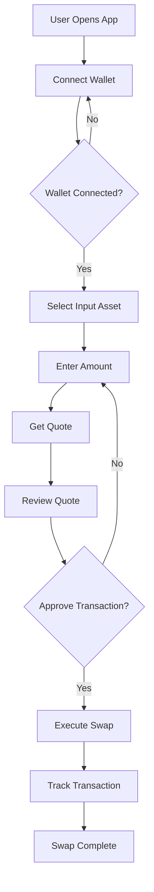

# CBTX - cbBTC Exchange Documentation

## Overview
CBTX is a decentralized exchange application that allows users to swap between cbBTC and other assets on the Base network. The application provides a user-friendly interface for token swaps with real-time quotes and transaction management.

## Architecture

### Server Components
The application consists of two main server components:

1. **Main Server (index.ts)**
   - Express.js server handling both development and production environments
   - Vite integration for development hot-reloading
   - Static file serving in production
   - Health check endpoint
   - Error handling middleware

2. **API Server (api.ts)**
   - Dedicated API server running on port 5001
   - CORS enabled
   - Configuration endpoint for BaseScan API key
   - JSON response handling

### Client Components
The client is a React-based single-page application with the following structure:

1. **Core Components**
   - `App.tsx`: Main application component with routing and providers
   - `Home.tsx`: Main swap interface
   - `Web3Provider`: Ethereum wallet integration

2. **Key Features**
   - Wallet connection via Coinbase Wallet
   - Token swap functionality
   - Real-time quote generation
   - Transaction management
   - Settings management (slippage, streaming interval)

## Technical Details

### Supported Assets
The application supports the following assets:
- ETH (Native)
- USDC
- cbBTC

### Web3 Integration
- Uses Coinbase Wallet SDK
- Supports Base network (Chain ID: 8453)
- Handles chain switching and wallet connection
- Manages account state and transactions

### Swap Process
1. User selects input and output assets
2. System generates real-time quotes
3. User approves token spending (if required)
4. Transaction is executed on-chain
5. System tracks transaction status

## User Flow



## Visual Style
The application features a modern, clean interface with:

### Color Scheme
The application uses a modern color palette with:
- Background: Clean white (#FFFFFF)
- Text: Dark gray (#333333)
- Primary Accent: Base blue (#0052FF)
- Secondary Accent: Light blue (#E6F0FF)
- Success: Green (#00C853)
- Error: Red (#FF3D00)
- Warning: Yellow (#FFC107)
- Border: Light gray (#E5E7EB)

### Asset and Chain Logo Display
The application uses a standardized format for displaying assets and their chain logos:

1. **Asset Logo Format**
   - Location: `/images/asset-logos/`
   - Naming convention: `{asset-name}-{symbol}-logo.svg`
   - Example: `bitcoin-btc-logo.svg`
   - Size: 32x32 pixels
   - Format: SVG preferred, PNG accepted

2. **Chain Logo Format**
   - Location: `/images/chain-logos/`
   - Naming convention: `{chain}.svg`
   - Example: `BASE.svg`
   - Size: 24x24 pixels
   - Format: SVG preferred

3. **Asset Identifier Format**
   - Format: `{CHAIN}.{ASSET}-{ADDRESS}`
   - Example: `BASE.CBBTC-0XCBB7C0000AB88B473B1F5AFD9EF808440EED33BF`
   - Special case for native assets: `{CHAIN}.{ASSET}` (e.g., `BASE.ETH`)

## API Integration

### Thorchain API
The application integrates with Thorchain's API for cross-chain swaps:

1. **Quote Generation**
   - Endpoint: `https://thornode.ninerealms.com/thorchain/quote/swap`
   - Parameters:
     - `amount`: Input amount in base units
     - `from_asset`: Source asset identifier
     - `to_asset`: Destination asset identifier
     - `destination`: Destination address
     - `streaming_interval`: Interval for streaming swaps
     - `streaming_quantity`: Quantity for streaming swaps
     - `affiliate`: Affiliate address
     - `affiliate_bps`: Affiliate basis points

2. **Inbound Addresses**
   - Endpoint: `https://thornode.ninerealms.com/thorchain/inbound_addresses`
   - Returns: List of valid inbound addresses for each chain
   - Used for: Determining deposit addresses for swaps

3. **Quote Response Structure**
   ```typescript
   interface QuoteResponse {
     inbound_address: string;
     inbound_confirmation_blocks: number;
     inbound_confirmation_seconds: number;
     outbound_delay_blocks: number;
     outbound_delay_seconds: number;
     fees: {
       asset: string;
       affiliate: string;
       outbound: string;
       liquidity: string;
       total: string;
       slippage_bps: number;
       total_bps: number;
     };
     router: string;
     expiry: number;
     memo: string;
     expected_amount_out: string;
     // ... additional fields
   }
   ```

### Base Network Integration
- RPC URL: `https://mainnet.base.org`
- Chain ID: 8453
- Native Currency: ETH
- Block Explorer: `https://basescan.org`

### Smart Contract Integration
1. **Token Contracts**
   - Standard ERC20 interface
   - Functions: `approve`, `allowance`, `transfer`
   - Decimals: Varies by token (ETH: 18, USDC: 6, cbBTC: 8)

2. **Router Contract**
   - Function: `depositWithExpiry`
   - Parameters:
     - `vault`: Thorchain vault address
     - `asset`: Token address
     - `amount`: Amount to deposit
     - `memo`: Swap memo
     - `expiry`: Transaction expiry timestamp

## Key Functions

### Server Functions
- `setupVite`: Configures development server
- `registerRoutes`: Registers API endpoints
- `getInboundAddresses`: Fetches Thorchain inbound addresses
- `calculateMinOutput`: Calculates minimum output for swaps

### Client Functions
- `useWeb3`: Manages wallet connection state
- `handleTransaction`: Processes swap transactions
- `approveERC20`: Handles token approvals
- `depositWithExpiry`: Executes swap deposits
- `formatBTCAmount`: Formats BTC amounts for display

## Environment Variables
- `BASESCAN_API_KEY`: Required for BaseScan API access
- `PORT`: Server port (default: 5000/5001)
- `NODE_ENV`: Environment mode (development/production)

## Error Handling
- Global error middleware
- Transaction error handling
- Wallet connection error handling
- API error responses
- User-friendly error messages

## Security Considerations
- API key management
- Wallet connection security
- Transaction validation
- Input sanitization
- CORS configuration

## Dependencies
- Express.js
- React
- Web3.js
- Coinbase Wallet SDK
- Vite
- React Query
- Zod (validation)
- Framer Motion (animations)

## Thorchain Integration Details

### Swap Memo Construction
The swap memo is a critical component that tells Thorchain how to process the transaction. The memo format follows this structure:

```
SWAP:{destination_asset}:{destination_address}:{price_limit}:{affiliate_address}:{affiliate_bps}
```

Example:
```
SWAP:BTC.BTC:bc1q...xyz:1234567890:-:8
```

Where:
- `SWAP`: Action type
- `BTC.BTC`: Destination asset identifier
- `bc1q...xyz`: Destination Bitcoin address
- `1234567890`: Price limit (minimum amount to receive)
- `-`: Affiliate address (empty in our case)
- `8`: Affiliate basis points (0.08%)

The price limit is calculated based on the expected output amount and slippage tolerance:
```typescript
priceLimit = Math.floor(((10000 - slipTolerance) * expectedAmountOut) / 10000)
```

### Token Approvals Process
Token approvals are required when swapping ERC20 tokens (like cbBTC or USDC) but not for native ETH. The process works as follows:

1. **When Approval is Needed:**
   - For any ERC20 token swap (cbBTC, USDC)
   - When the current allowance is less than the swap amount
   - When the router contract address changes

2. **When Approval is Not Needed:**
   - For native ETH swaps
   - When sufficient allowance already exists
   - When the token is already approved for the current router

3. **Approval Process:**
   ```typescript
   // Check current allowance
   const allowance = await tokenContract.methods
     .allowance(ownerAddress, routerAddress)
     .call();

   // If allowance is insufficient, request approval
   if (BigInt(allowance) < BigInt(amount)) {
     await tokenContract.methods
       .approve(routerAddress, amount)
       .send({ from: ownerAddress });
   }
   ```

### Swap Lifecycle
After submitting a swap, the following sequence occurs:

1. **Transaction Submission**
   - User approves the transaction in their wallet
   - Transaction is broadcast to the Base network
   - Router contract receives the deposit

2. **Thorchain Processing**
   - Thorchain validators detect the inbound transaction
   - Validators verify the memo and amounts
   - Network reaches consensus on the swap
   - Outbound transaction is prepared

3. **Confirmation Times**
   - Base network: ~2 minutes for confirmation
   - Thorchain: ~10-20 minutes for processing
   - Destination chain: Varies by network (Bitcoin: ~10 minutes)

4. **Status Tracking**
   - Transaction hash is provided immediately
   - Inbound confirmation can be tracked on BaseScan
   - Outbound transaction can be tracked on destination chain explorer
   - Streaming swaps may have multiple outbound transactions

5. **Error Handling**
   - Failed transactions are refunded automatically
   - Expired transactions (after 15 minutes) are refunded
   - Invalid memos result in refunds
   - Insufficient liquidity triggers refunds

### Streaming Swaps
For larger transactions, Thorchain supports streaming swaps to minimize price impact:

1. **Configuration**
   - `streaming_interval`: Time between chunks (1-10 blocks)
   - `streaming_quantity`: Number of chunks to split the swap into
   - Default: 1 block interval, auto streaming quantity

2. **Benefits**
   - Reduced price impact
   - Better execution prices
   - Lower slippage

3. **Considerations**
   - Longer total swap time
   - Multiple transactions to track
   - Higher gas costs

### Security Measures
1. **Price Protection**
   - Slippage tolerance (default 3%)
   - Price limits in memo
   - Minimum output amounts

2. **Transaction Safety**
   - 15-minute expiry on deposits
   - Automatic refunds for failed transactions
   - Validator consensus requirements

3. **Network Security**
   - Multiple validator nodes
   - Bonded security model
   - Slashing conditions for misbehavior
